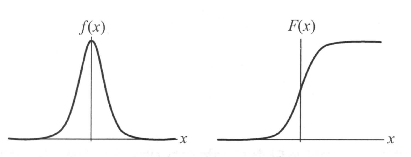

[TOC]

这一章分为三个部分，逻辑斯蒂回归，最大熵模型和模型的最优化算法。

最大熵模型这一块，《统计机器学习》有些地方讲的不清楚，我补充了一部分。

# 6.1 逻辑斯蒂回归
设X是连续随机变量，且X服从**逻辑斯蒂（logistic）分布**，也叫sigmoid函数，则：
$$
\begin{equation}
F(x) = P(X \leq x)=\frac{1}{1+\exp{-(x-\mu)/\gamma}}
\end{equation}
$$
密度函数为：
$$
\begin{equation}
f(x) = F'(x)=\frac{1+\exp{-(x-\mu)/\gamma}}{\gamma (1+\exp{-(x-\mu)/\gamma})^2}
\end{equation}
$$
其中， $\mu$ 是位置参数， $\gamma$ 是形状参数。  
logistic分布的密度函数和分布函数

### 模型
**logistic回归模型**定义为：
$$
\begin{equation}
\begin{split}
P(Y=1|x)=\frac{\exp(w\cdot x+b)}{1+\exp(w\cdot x+b)} \\
P(Y=0|x)=\frac{1}{1+\exp(w\cdot x+b)} 
\end{split}
\end{equation}
$$
其中， $x \in \mathbb{R}^n$ 是输入， $Y \in \{0,1\}$ 是输出； $w\in \mathbb{R}^n$ ， $b$ 是可学习参数。

### 参数估计
设模型为：
$$
\begin{equation}
\begin{aligned}
P(Y=1| x)&=\pi (x) \\
P(Y=0| x)&=1-\pi (x)
\end{aligned}
\end{equation}
$$
其中 $x\in \mathbb{R}^{n+1}$ ，则似然函数为：
$$
\begin{equation}
\prod^{n}_{i=1}[\pi(x)]^{y_i}[1-\pi(x)]^{1-y_i}
\end{equation}
$$
则对数似然函数为：
$$
\begin{equation}
\begin{aligned}
L(w) &=\sum_{i=1}^{N}[y_{i} \log \pi(x_{i})+(1-y_{i}) \log (1-\pi(x_{i}))] \\
&=\sum_{i=1}^{N}[y_{i} \log \frac{\pi(x_{i})}{1-\pi(x_{i})}+\log (1-\pi(x_{i}))] \\
&=\sum_{i=1}^{N}[y_{i}(w \cdot x_{i})-\log (1+\exp (w \cdot x_{i})].
\end{aligned}
\end{equation}
$$
对 $L(w)$ 求极大值，可以得到 $w$ 的估计值。为题转化为最优化问题，可以采用梯度下降法或者牛顿法。

### 多项式逻辑回归
$K$ 分类逻辑回归模型：
$$
\begin{equation}
\begin{aligned}
P(Y=k | x)&=\frac{\exp (w_{k} \cdot x)}{1+\sum_{k=1}^{K-1} \exp (w_{k} \cdot x)}, \quad k=1,2, \cdots, K-1 \\
P(Y=K | x)&=\frac{1}{1+\sum_{k=1}^{K-1} \exp (w_{k} \cdot x)}
\end{aligned}
\end{equation}
$$

# 6.2 最大熵模型
### 最大熵原理
**最大熵原理**认为，学习概率模型的时候，在所有可能的概率模型中，熵最大的模型是最好的。熵定义为 $H(P)=-\sum \limits _x P(x) \log P(x)$ ，有下面的性质：
$$
\begin{equation}
0 \leq H(P) \leq \log |X|
\end{equation}
$$
其中，$|X|$是$X$的取值个数，当且仅当$X$取均匀分布的时候， $H(P)$ 最大。

### 最大熵模型
假设分类模型服从条件概率分布 $P(Y | X)$，$X \in \mathbb{R}^n$ 表示输入， $Y \in \mathbb{R}$ 表示输出。给定下列训练数据集 $T=\{(x_1,y_1),...,(x_N,y_N)\}$ ，学习的目标是根据最大熵原理选择最好的分类模型。

首先确定 $P(X,Y)$ 和 $P(X)$ 的经验分布，用 $\widetilde{P}(X,Y)$和$\widetilde{P}(X)$ 表示：
$$
\begin{equation}
\begin{aligned}
\widetilde{P}(X=x,Y=y)&=\frac{count(X=x,Y=y)}{N} \\
\widetilde{P}(X=x)&=\frac{count(X=x)}{N}
\end{aligned}
\end{equation}
$$
用特征函数 $f(x,y)$ 描述 $x$ 和 $y$ 的某一个事实：
$$
\begin{equation}
f(x,y)=
\begin{cases}
1,\quad (x,y)\ satisfy\ a\ certain\ fact; \\
0,\quad otherwise;
\end{cases}
\end{equation}
$$
如果模型 $P(Y|X)$ 能够学习到知识，则特征函数 $f(x,y)$ 关于经验分布 $\widetilde{P}(X,Y)$ 与模型 $P(Y| X)$ 和经验分布 $\widetilde{P}(x)$ 的期望值应相等，即：
$$
\begin{equation}
E_{\widetilde{P}}(f)=E_{P}(f)
\end{equation}
$$
其中：
$$
\begin{aligned}
E_{\widetilde{P}}(f)&=\sum _{x,y}\widetilde{P}(x,y)f(x,y)\\
E_{P}(f)&=\sum _{x,y}\widetilde{P}(x)P(y|x)f(x,y)
\end{aligned}
$$

若有 $n$ 个特征函数 $\{f_1,...,f_n\}$ ，则对应 $n$ 个约束条件，则**最大熵模型**定义为满足所有约束条件的模型集合 $\mathcal{C} = \{P\in \mathcal{P}|E_{\widetilde{P}}(f_i)=E_{P}(f_i), \quad i=1,...,n\}$ 中，定义在条件概率分布 $P(Y|X)$ 上条件熵最大的模型。该条件熵为：
$$
\begin{equation}
H(P)=-\sum _{x,y} \widetilde{P}(x)P(y|x)\log P(y|x)
\end{equation}
$$

### 最大熵模型的学习
最大熵模型可以形式化为约束优化问题：
$$
\begin{equation}
\max \limits _{P\in \mathcal{C}} H(P)=-\sum _{x,y} \widetilde{P}(x)P(y|x)\log P(y|x)
\end{equation}
$$
$$
\begin{aligned}
s.t.\quad &E_{\widetilde{P}}(f_i)=E_{P}(f_i), \quad i=1,...,n\\
&\sum _{y}P(y|x)=1
\end{aligned}
$$
改成最小化问题为：
$$
\begin{equation}
\min \limits _{P\in \mathcal{C}} -H(P)=\sum _{x,y} \widetilde{P}(x)P(y|x)\log P(y|x)
\end{equation}
$$
$$
\begin{aligned}
s.t.\quad &E_{\widetilde{P}}(f_i)=E_{P}(f_i), \quad i=1,...,n\\
&\sum _{y}P(y|x)=1
\end{aligned}
$$
用拉格朗日乘子法，将带约束的最优化问题转化为无约束的最优化问题，引进拉格朗日乘子 $\{w_0,w_1,...,w_n\}$ ，则拉格朗日函数：
$$
\begin{equation}
\begin{aligned}
L(P, w) \equiv &-H(P)+w_{0}(1-\sum_{y} P(y | x))+\sum_{i=1}^{n} w_{i}(E_{\tilde{P}}(f_{i})-E_{P}(f_{i})) \\
=& \sum_{x, y} \tilde{P}(x) P(y | x) \log P(y | x)+w_{0}(1-\sum_{y} P(y | x))+\sum_{i=1}^{n} w_{i}(\sum_{x, y} \tilde{P}(x, y) f_{i}(x, y)-\sum_{x, y} \tilde{P}(x) P(y | x) f_{i}(x, y))
\end{aligned}
\end{equation}
$$
原始问题是：
$$
\begin{equation}
\min _{p\in \mathcal{C}} \max _{w} L(P,w)
\end{equation}
$$
对偶问题是:
$$
\begin{equation}
\max _{w} \min _{P \in \mathcal{C}} L(P,w)
\end{equation}
$$
> 原书中说 $L(P,w)$是对$P$ 的凸函数，因为 $L(P,w)$ 对 $P$相当于$P\log P$ 。这里满足 Slater 条件，具有强对偶性，具体内容可以看这本书的附录。  
* 首先计算 $\min \limits _{P \in \mathcal{C}} L(P,w)$ 此内部极小化过程，并做如下记号：
    $$
    \begin{equation}
    P_w = \arg \min \limits _{P \in \mathcal{C}} L(P,w) = P_w(y|x)
    \end{equation}
    $$
    $$
    \begin{equation}
    \mathit{\Psi}(w) = \min \limits _{P \in \mathcal{C}} L(P,w) = L(P_w,w)
    \end{equation}
    $$
    具体过程如下：  
    求解 $L(P,w)$对$P$ 的偏导数，
    $$
    \begin{equation}
    \begin{aligned}
    \frac{\partial L(P, w)}{\partial P(y | x)} &=\sum_{x, y} \tilde{P}(x)(\log P(y | x)+1)-\sum_{y} w_{0}-\sum_{x, y}(\tilde{P}(x) \sum_{i=1}^{n} w_{i} f_{i}(x, y)) \\
    &=\sum_{x, y} \tilde{P}(x)(\log P(y | x)+1-w_{0}-\sum_{i=1}^{n} w_{i} f_{i}(x, y))
    \end{aligned}
    \end{equation}
    $$
    令之等于0可以解出：
    $$
    \begin{equation}
    P(y | x)=\exp (\sum_{i=1}^{n} w_{i} f_{i}(x, y)+w_{0}-1)=\frac{\exp (\sum \limits _{i=1}^{n} w_{i} f_{i}(x, y))}{\exp (1-w_{0})}
    \end{equation}
    $$
    由于 $\sum \limits _{y} P(y | x)=1$ ，得
    $$
    \begin{equation}
    P_{w}(y | x)=\frac{1}{Z_{w}(x)} \exp (\sum_{i=1}^{n} w_{i} f_{i}(x, y))
    \end{equation}
    $$
    其中 $Z_{w}(x)$ 是规范化因子：
    $$
    \begin{equation}
    Z_{w}(x)=\sum_{y} \exp (\sum_{i=1}^{n} w_{i} f_{i}(x, y))
    \end{equation}
    $$
    > 在这里省略了求解过程，具体为：先求出 $w_0$ ，再代回整理 $(1-w_0)$ 为 $Z_w$。

    > **最大熵模型**可以用 $(22)$ ， $(23)$ 两式表示。
    
* 然后求解对偶问题的极大化问题$\max \limits _w \mathit{\Psi}(w)$，并记解为：
    $$
    \begin{equation}
    w^* = \arg \max \mathit{\Psi}(w)
    \end{equation}
    $$
    可以证明，极大化问题等价于 $(22)$ ， $(23)$ 的最大似然。证明如下：  
    对数似然函数：
    $$
    \begin{equation}
    \begin{aligned}
    L_{\tilde{P}}(P_{w}) &=\sum_{x, y} \tilde{P}(x, y) \log P(y | x) \\
    &=\sum_{x, y} \tilde{P}(x, y) \sum_{i=1}^{n} w_{i} f_{i}(x, y)-\sum_{x, y} \tilde{P}(x, y) \log Z_{w}(x) \\
    &=\sum_{x, y} \tilde{P}(x, y) \sum_{i=1}^{n} w_{i} f_{i}(x, y)-\sum_{x} \tilde{P}(x) \log Z_{w}(x)
    \end{aligned}
    \end{equation}
    $$
    再看对偶函数 $\mathit{\Psi}(w)$ 。由式 $(14)$ 和 $(19)$ 可得：
    $$
    \begin{equation}
    \begin{aligned}
    \mathit{\Psi}(w)=& \sum_{x, y} \tilde{P}(x) P_{w}(y | x) \log P_{w}(y | x)+\\
    & \sum_{i=1}^{n} w_{i}(\sum_{x, y} \tilde{P}(x, y) f_{i}(x, y)-\sum_{x, y} \tilde{P}(x) P_{w}(y | x) f_{i}(x, y)) \\
    =& \sum_{x, y} \tilde{P}(x, y) \sum_{i=1}^{n} w_{i} f_{i}(x, y)+\sum_{x, y} \tilde{P}(x) P_{w}(y | x)(\log P_{w}(y | x)-\sum_{i=1}^{n} w_{i} f_{i}(x, y)) \\
    -& \sum_{x, y} \tilde{P}(x, y) \sum_{i=1}^{n} w_{i} f_{i}(x, y)-\sum_{x, y} \tilde{P}(x) P_{w}(y | x) \log Z_{w}(x) \\
    =& \sum_{x, y} \tilde{P}(x, y) \sum_{i=1}^{n} w_{i} f_{i}(x, y)-\sum_{x} \tilde{P}(x) \log Z_{w}(x)
    \end{aligned}
    \end{equation}
    $$
    两式相等，证毕。

# 6.3 最优化算法
### 改进迭代尺度算法
改进迭代尺度法（improved iterative scaling，IIS）是最大熵模型的学习算法。IIS的基本想法是：对于学习参数 $w=\{w_1,\cdots,w_n\}$ ，寻找一个 $\delta$ 迭代 $w\larr w+\delta$ 使得似然函数 $(25)$ 不断增大，然而同时优化困难，所以单独优化 $w$ 的某一个。推导如下：
$$
\begin{equation}
\begin{aligned}
L(w+\delta)-L(w) &=\sum_{x, y} \tilde{P}(x, y) \log P_{w+\delta}(y | x)-\sum_{x, y} \tilde{P}(x, y) \log P_{w}(y | x) \\
&=\sum_{x, y} \tilde{P}(x, y) \sum_{i=1}^{n} \delta_{i} f_{i}(x, y)-\sum_{x} \tilde{P}(x) \log \frac{Z_{w+\delta}(x)}{Z_{w}(x)}
\end{aligned}
\end{equation}
$$
利用不等式 $-\log \alpha \geqslant 1-\alpha, \quad \alpha>0$ ，可以得到：
$$
\begin{equation}
\begin{aligned}
L(w+\delta)-L(w) & \geqslant \sum_{x, y} \tilde{P}(x, y) \sum_{i=1}^{n} \delta_{i} f_{i}(x, y)+1-\sum_{x} \tilde{P}(x) \frac{Z_{w+\delta}(x)}{Z_{w}(x)} \\
&=\sum_{x, y} \tilde{P}(x, y) \sum_{i=1}^{n} \delta_{i} f_{i}(x, y)+1-\sum_{x} \tilde{P}(x) \sum_{y} P_{w}(y | x) \exp \sum_{i=1}^{n} \delta_{i} f_{i}(x, y)
\end{aligned}
\end{equation}
$$
将右端记为： $A(\delta | w)$，为$L(w+\delta)-L(w)$ 的下界。  
引进 $f^{\#}(x, y)=\sum_{i} f_{i}(x, y)$ ，表示所有特征在 $(x, y)$ 出现的次数。这样， $A(\delta | w)$ 可以改写为
$$
\begin{equation}
\begin{aligned}
A(\delta | w)=& \sum_{x, y} \tilde{P}(x, y) \sum_{i=1}^{n} \delta_{i} f_{i}(x, y)+1-\sum_{x} \tilde{P}(x) \sum_{y} P_{w}(y | x) \exp (f^{\#}(x, y) \sum_{i=1}^{n} \frac{\delta_{i} f_{i}(x, y)}{f^{\#}(x, y)})
\end{aligned}
\end{equation}
$$
利用指数函数的凸性以及对任意 $i$ , 有 $\frac{f_{i}(x, y)}{f^{\#}(x, y)} \geqslant 0$ 且 $\sum \limits _{i=1}^{n} \frac{f_{i}(x, y)}{f^{\#}(x, y)}=1$ 这一事实, 根据 Jensen 不等式, 得到
$$
\begin{equation}
\exp (\sum_{i=1}^{n} \frac{f_{i}(x, y)}{f^{\#}(x, y)} \delta_{i} f^{\#}(x, y)) \leqslant \sum_{i=1}^{n} \frac{f_{i}(x, y)}{f^{\#}(x, y)} \exp (\delta_{i} f^{\#}(x, y))
\end{equation}
$$
将不等式右端记为 $B(\delta|w)$ 。于是有：
$$
\begin{equation}
L(w+\delta)-L(w) \geqslant A(\delta|w) \geqslant B(\delta|w)
\end{equation}
$$

求 $B(\delta | w)$ 对 $\delta_{i}$ 的偏导数:
$$
\begin{equation}
\frac{\partial B(\delta | w)}{\partial \delta_{i}}=\sum_{x, y} \tilde{P}(x, y) f_{i}(x, y)-\sum_{x} \tilde{P}(x) \sum_{y} P_{w}(y | x) f_{i}(x, y) \exp (\delta_{i} f^{\#}(x, y))
\end{equation}
$$
在式 $(6.32)$ 里, 除 $\delta_{i}$ 外不含任何其他变量。令偏导数 0 得到
$$
\begin{equation}
\sum_{x, y} \tilde{P}(x) P_{w}(y | x) f_{i}(x, y) \exp (\delta_{i} f^{\#}(x, y))=E_{\tilde{P}}(f_{i})
\end{equation}
$$
于是, 依次对 $\delta_{i}$ 求解方程 $(32)$ 可以求出 $\delta$ 。

### 牛顿法
牛顿法和拟牛顿法按照标准算法流程优化$-L_{\tilde{P}}(P_{w})$即可。  
下一章介绍。
