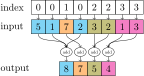

## pytorch

#### scatter

> `Tensor.scatter_`(*dim*, *index*, *src*, *reduce=None*) → torch.Tensor

Writes all values from the tensor `src` into `self` at the indices specified in the `index` tensor.

```python
self[index[i][j][k]][j][k] = src[i][j][k]  # if dim == 0
self[i][index[i][j][k]][k] = src[i][j][k]  # if dim == 1
self[i][j][index[i][j][k]] = src[i][j][k]  # if dim == 2
```

Parameters

- **dim** (*int*) – the axis along which to index
- **index** (*LongTensor*) – the indices of elements to scatter, can be either empty or of the same dimensionality as `src`. When empty, the operation returns `self` unchanged.
- **src** ([*Tensor or float*) – the source element(s) to scatter.
- **reduce** (*str*, *optional*) – reduction operation to apply, can be either `'add'` or `'multiply'`.

Example

```python
>>> t = torch.full((2, 4), 2.)
>>> index = torch.tensor([[2], [3]])
>>> t.scatter_(1, index, 1.23, reduce='add')
tensor([[2.0000, 2.0000, 3.2300, 2.0000],
        [2.0000, 2.0000, 2.0000, 3.2300]])
```


#### gather

>  `torch.gather`(*input*, *dim*, *index*, *\**, *sparse_grad=False*, *out=None*) → torch.Tensor

Gathers values along an axis specified by dim.

```python
out[i][j][k] = input[index[i][j][k]][j][k]  # if dim == 0
out[i][j][k] = input[i][index[i][j][k]][k]  # if dim == 1
out[i][j][k] = input[i][j][index[i][j][k]]  # if dim == 2
```

Parameters

- **input** (*Tensor*) – the source tensor
- **dim** (*int*) – the axis along which to index
- **index** (*LongTensor*) – the indices of elements to gather

Keyword Arguments

- **sparse_grad** (*bool*)*,* *optional*) – If `True`, gradient w.r.t. `input` will be a sparse tensor.
- **out** (*Tensor*)*,* *optional*) – the destination tensor

Example：

```python
>>> t = torch.tensor([[1, 2], [3, 4]])
>>> index = torch.tensor([[0, 0], [1, 0]])
>>> torch.gather(t, 1, index)
tensor([[ 1,  1],
        [ 4,  3]])
```


## pytorch_scatter

#### scatter

>  `torch_scatter.scatter`(*src*, *index*, *dim=-1*, *out=None*, *dim_size=None*, *reduce='sum'*) -> torch.Tensor

Reduces all values from the `src` tensor into `out` at the indices specified in the `index` tensor along a given axis `dim`.

(unsorted)
$$
\mathrm{out}_i = \mathrm{out}_i + \sum_j~\mathrm{src}_j
$$



Parameters

- **src** – The source tensor.
- **index** – The indices of elements to scatter.
- **dim** – The axis along which to index. (default: `-1`)
- **out** – The destination tensor.
- **dim_size** – If `out` is not given, automatically create output with size `dim_size` at dimension `dim`. If `dim_size` is not given, a minimal sized output tensor according to `index.max() + 1` is returned.
- **reduce** – The reduce operation (`"sum"`, `"mul"`, `"mean"`, `"min"` or `"max"`). (default: `"sum"`)

#### 4sparse-matrix  
`segment_coo`, `segment_scr`


## tensorflow

#### gather
> tf.gather(params, indices, validate_indices=None, axis=None, batch_dims=0, name=None)

Gather slices from `params` axis `axis` according to `indices`.

| `params`           | The `Tensor` from which to gather values. Must be at least rank `axis + 1`. |
| ------------------ | ------------------------------------------------------------ |
| `indices`          | The index `Tensor`. Must be one of the following types: `int32`, `int64`. The values must be in range `[0, params.shape[axis])`. |
| `validate_indices` | **Deprecated**, does nothing. Indices are always validated on CPU, never validated on GPU. **Caution:** On CPU, if an out of bound index is found, an error is raised. On GPU, if an out of bound index is found, a 0 is stored in the corresponding output value. |
| `axis`             | A `Tensor`. Must be one of the following types: `int32`, `int64`. The `axis` in `params` to gather `indices` from. Must be greater than or equal to `batch_dims`. Defaults to the first non-batch dimension. Supports negative indexes. |
| `batch_dims`       | An `integer`. The number of batch dimensions. Must be less than or equal to `rank(indices)`. |
| `name`             | A name for the operation (optional).                         |


```python
>>> params = tf.constant([[0, 1.0, 2.0],
                      [10.0, 11.0, 12.0],
                      [20.0, 21.0, 22.0],
                      [30.0, 31.0, 32.0]])
>>> tf.gather(params, indices=[3,1]).numpy()
array([[30., 31., 32.],
       [10., 11., 12.]], dtype=float32)
>>> tf.gather(params, indices=[2,1], axis=1).numpy()
array([[ 2.,  1.],
       [12., 11.],
       [22., 21.],
       [32., 31.]], dtype=float32)
```

#### unsorted_segment_*OP*

* unsorted_segment_sum

    > tf.math.unsorted_segment_sum(data, segment_ids, num_segments, name=None)

    Computes the sum along segments of a tensor.

    Computes a tensor such that $output[i] = \sum \limits _{j...} data[j...]$, where the sum is over tuples `j...` such that `segment_ids[j...] == i`. Unlike `SegmentSum`, `segment_ids` need not be sorted and need not cover all values in the full range of valid values.

    If the sum is empty for a given segment ID `i`, `output[i] = 0`. If the given segment ID `i` is negative, the value is dropped and will not be added to the sum of the segment.

    `num_segments` should equal the number of distinct segment IDs.


| Args           |                                                              |
| :------------- | ------------------------------------------------------------ |
| `data`         | A `Tensor`. Must be one of the following types: `float32`, `float64`, `int32`, `uint8`, `int16`, `int8`, `complex64`, `int64`, `qint8`, `quint8`, `qint32`, `bfloat16`, `uint16`, `complex128`, `half`, `uint32`, `uint64`. |
| `segment_ids`  | A `Tensor`. Must be one of the following types: `int32`, `int64`. A tensor whose shape is a prefix of `data.shape`. |
| `num_segments` | A `Tensor`. Must be one of the following types: `int32`, `int64`. |
| `name`         | A name for the operation (optional).                         |

~~~python
```python
>>> data = tf.constant([[1,2,3,4], [5,6,7,8], [4,3,2,1]])
>>> segment_ids = tf.constant([0, 1, 0])
>>> tf.math.unsorted_segment_sum(data, segment_ids, num_segments=2)
[[ 5, 5, 5, 5],
 [5, 6, 7, 8]]
```
~~~

* unsorted_segment_prod
  $output = \prod \limits _{j...} data[j...]$, where the product is over tuples `j...` such that `segment_ids[j...] == i`.

```python
>>> data = tf.constant([[1,2,3,4], [5,6,7,8], [4,3,2,1]])
>>> segment_ids = tf.constant([0, 1, 0])
>>> tf.unsorted_segment_prod(data, segmeng_ids, num_segments=2)
[[ 4,  6, 6, 4],
 [5,  6, 7, 8]]
```

* unsorted_segment_sqrt_n

  $output = \frac{1}{\sqrt{N_i}}\sum \limits _{j...} data[j...]$, where the sum is over tuples j... such that `segment_ids[j...] == i` with $N_i$ being the number of occurrences of id $i$.

* unsorted_segment_max

* unsorted_segment_mean

* unsorted_segment_min

#### tensor_scatter_nd_OP

OP: sub, min, max, add, update

* tensor_scatter_nd_update

```py
tf.tensor_scatter_nd_add(tensor, indices, updates, name=None)
```

| Args      |                                  |
| :-------- | -------------------------------- |
| `tensor`  | Tensor to copy/update.           |
| `indices` | Indices to update.               |
| `updates` | Updates to apply at the indices. |
| `name`    | Optional name for the operation. |

```python
>>> tensor = [0, 0, 0, 0, 0, 0, 0, 0]    # tf.rank(tensor) == 1
>>> indices = [[1], [3], [4], [7]]       # num_updates == 4, index_depth == 1
>>> updates = [9, 10, 11, 12]            # num_updates == 4
>>> print(tf.tensor_scatter_nd_update(tensor, indices, updates))
tf.Tensor([ 0 9 0 10 11 0 0 12], shape=( 8, )，dtype=int32)

```

#### reduce_OP

OP: sum, prod, min, mean, max, variance, std

* reduce_sum

```
tf.math.reduce_sum(input_tensor, axis=None, keepdims=False, name=None)
```
Reduces `input_tensor` along the dimensions given in `axis`. Unless `keepdims` is true, the rank of the tensor is reduced by 1 for each of the entries in `axis`, which must be unique. If `keepdims` is true, the reduced dimensions are retained with length 1.

| Args           |                                                              |
| :------------- | ------------------------------------------------------------ |
| `input_tensor` | The tensor to reduce. Should have numeric type.              |
| `axis`         | The dimensions to reduce. If `None` (the default), reduces all dimensions. Must be in the range `[-rank(input_tensor),rank(input_tensor)]`. |
| `keepdims`     | If true, retains reduced dimensions with length 1.           |
| `name`         | A name for the operation (optional).                         |


## paddle

#### gather

> paddle.gather(*x*, *index*, *axis=None*, *name=None*) → paddle.Tensor

Parameters

- **x** (*Tensor*) – The source input tensor with **rank>=1**. Supported data type is int32, int64, float32, float64 and uint8 (only for CPU), float16 (only for GPU).
- **index** (*Tensor*) – The index input tensor with **rank=1**. Data type is int32 or int64.
- **axis** (*Tensor*|*int*, *optional*) – The axis of input to be gathered, it’s can be int or a Tensor with data type is int32 or int64. The default value is None, if None, the `axis` is 0.
- **name** (*str*, *optional*) – The default value is None. Normally there is no need for user to set this property. For more information, please refer to [Name](https://www.paddlepaddle.org.cn/documentation/docs/en/api_guides/low_level/program_en.html#api-guide-name) .

```python
>>> x = paddle.to_tensor(np.array([[1,2],[3,4],[5,6]]))
>>> index = paddle.to_tensor(np.array([0,1]))
>>> output = paddle.gather(x, index, axis=0)
[[1,2],[3,4]]
```

#### gather_nd

> paddle.gather_nd(*x*, *index*, *name=None*) → paddle.Tensor

Parameters

- **x** (*Tensor*) – The input Tensor which it’s data type should be bool, float32, float64, int32, int64.
- **index** (*Tensor*) – The index input with rank > 1, index.shape[-1] <= input.rank. Its dtype should be int32, int64.
- **name** (*str**,* *optional*) – The default value is None. Normally there is no need for user to set this property. For more information, please refer to [Name](https://www.paddlepaddle.org.cn/documentation/docs/en/api_guides/low_level/program_en.html#api-guide-name) .

#### scatter

> paddle.scatter(*x*, *index*, *updates*, *overwrite=True*, *name=None*)  → paddle.Tensor

Parameters

- **x** (*Tensor*) – The input N-D Tensor with ndim>=1. Data type can be float32, float64.

- **index** (*Tensor*) – The index 1-D Tensor. Data type can be int32, int64. The length of index cannot exceed updates’s length, and the value in index cannot exceed input’s length.

- **updates** (*Tensor*) – update input with updates parameter based on index. shape should be the same as input, and dim value with dim > 1 should be the same as input.

- **overwrite** (*bool*) –

  The mode that updating the output when there are same indices. If True, use the overwrite mode to update the output of the same index,

  System Message: ERROR/3 (/usr/local/lib/python3.8/site-packages/paddle/tensor/manipulation.py:docstring of paddle.tensor.manipulation.scatter, line 38)

  Unexpected indentation.

  > if False, use the accumulate mode to update the output of the same index.Default value is True.

- **name** (*str**,* *optional*) – The default value is None. Normally there is no need for user to set this property. For more information, please refer to [Name](https://www.paddlepaddle.org.cn/documentation/docs/en/api_guides/low_level/program_en.html#api-guide-name) .

不用对齐

```python
x = paddle.to_tensor([[1, 1], [2, 2], [3, 3]], dtype='float32')
index = paddle.to_tensor([2, 1, 0, 1], dtype='int64')
updates = paddle.to_tensor([[1, 1], [2, 2], [3, 3], [4, 4]], dtype='float32')

output1 = paddle.scatter(x, index, updates, overwrite=False)
# [[3., 3.],
#  [6., 6.],
#  [1., 1.]]

output2 = paddle.scatter(x, index, updates, overwrite=True)
# CPU device:
# [[3., 3.],
#  [4., 4.],
#  [1., 1.]]
# GPU device maybe have two results because of the repeated numbers in index
# result 1:
# [[3., 3.],
#  [4., 4.],
#  [1., 1.]]
# result 2:
# [[3., 3.],
#  [2., 2.],
#  [1., 1.]]
```

## PGL

```
import paddle
import pgl
data = paddle.to_tensor([[1, 2, 3], [3, 2, 1], [4, 5, 6]], dtype='float32')
segment_ids = paddle.to_tensor([0, 0, 1], dtype='int32')
out = pgl.math.segment_sum(data, segment_ids)
#Outputs: [[4., 4., 4.], [4., 5., 6.]]
```
